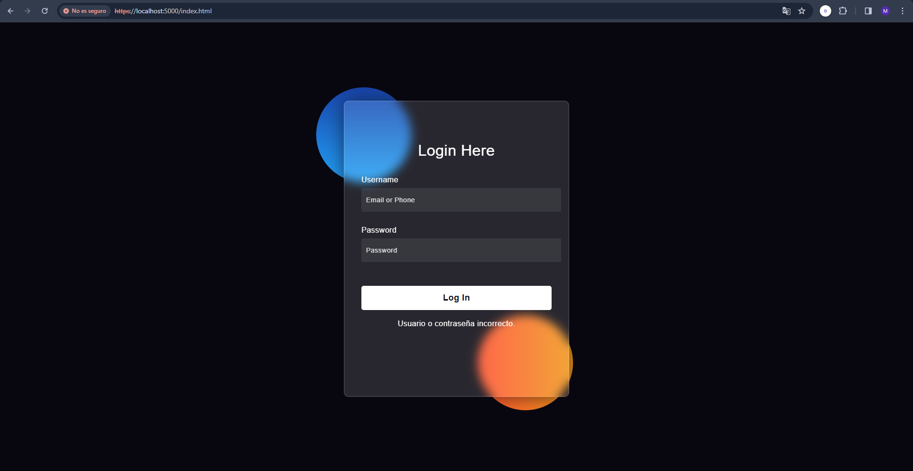
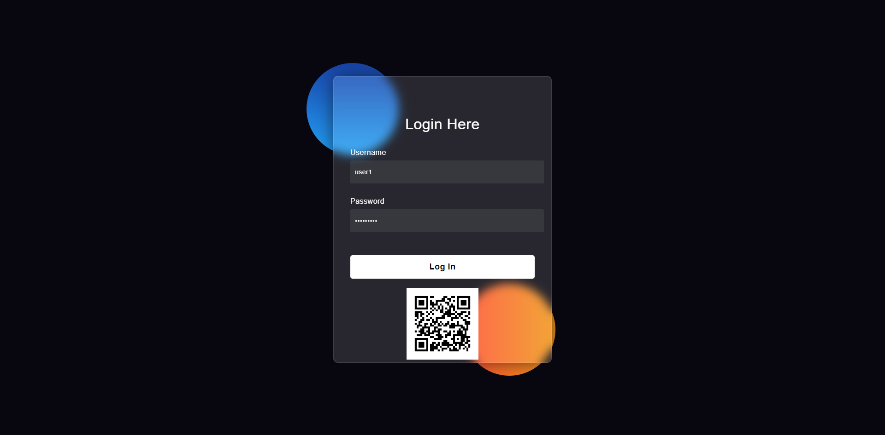
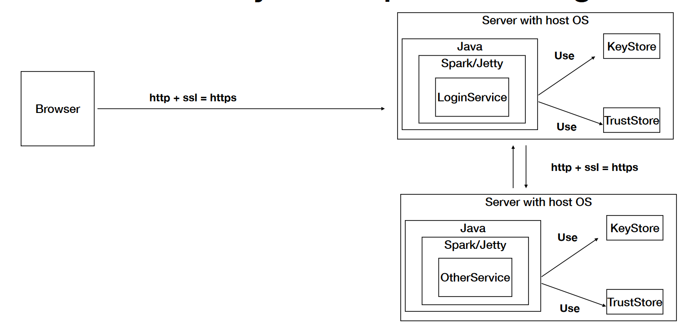

# TALLER ARQUITECTURAS EN AWS

## Descripción

La aplicación es un sistema basado en web que ofrece acceso seguro a través de un navegador. Su arquitectura de seguridad se centra en garantizar la autenticación, autorización y la integridad de los usuarios. Esto se logra mediante un proceso de autenticación robusto que verifica las credenciales de los usuarios y de los servidores antes de permitirles el acceso a la aplicación. 

## Demostración en AWS

https://github.com/MiguelBarreraD/APLICACI-N_SEGURA-/assets/80360472/1056f183-a586-4376-aade-5f18c5dece30

## Requisitos

    1. git - Control de versiones
    2. Maven - Gestor de dependencias
    3. Java - Lenguaje de programación

## Instalación local

Para poder intalar el proyecto se requiere tener instalado los requisitos anteriores:

Clone el repositorio

    $ git clone https://github.com/MiguelBarreraD/APLICACI-N_SEGURA-.git

Entre a la carpeta del proyecto

    $ cd APLICACI-N_SEGURA-

Compilar el código fuente de la aplicación, ejecuta las pruebas unitarias y empaqueta el código compilado en un formato que puede ser ejecutado o desplegado, como un archivo JAR para aplicaciones Java.

    $ mvn clean install

Ejecute los siguientes comandos en consolas diferentes:

    $ mvn exec:java '-Dexec.mainClass=org.example.Servers.AppServer' 
    $ mvn exec:java '-Dexec.mainClass=org.example.Servers.QRCodeAPI' 

Ingrese a la siguiente URL en su navegador:

    $ https://localhost:5000/index.html

Ya puede usar la aplicación:

Usuarios con los que puede probar

Usuario | Contraseña
--------|------------
user1   |   password1
user2   | password2
user3   | password3

Si la autenticación es exitosa este le mostrará un QR, de lo contrario no

## Arquitecura de la aplicación

La aplicación está compuesta por dos máquinas virtuales que se comunican a través de un protocolo seguro. En una de estas máquinas virtuales se ejecuta el servicio AppServer, mientras que en la otra se ejecuta el servicio QRCodeAPI.

**AuthenticationService:**

La clase AuthenticationService proporciona funcionalidades para la autenticación de usuarios en la aplicación. Su funcionamiento se basa en el uso de un mapa (Map) que almacena los nombres de usuario como claves y las contraseñas cifradas como valores. La clase ofrece métodos para agregar nuevos usuarios, autenticar usuarios existentes y realizar operaciones de hashing utilizando el algoritmo SHA-256. Esta clase es crucial para garantizar la autenticación segura de los usuarios y proteger los datos sensibles de la aplicación.

**GenQR:**

La clase GenQR es responsable de generar imágenes de códigos QR. Utiliza la biblioteca ZXing para crear un código QR a partir de una URL predefinida. El código QR generado se devuelve como un arreglo de bytes en formato PNG. Esta clase es útil para proporcionar una forma segura y conveniente de compartir información, como enlaces URL, de manera visual.

**AppServer:**

La clase AppServer es la clase principal que inicia el servidor de la aplicación. En su método main, configura el servidor Spark Java para escuchar en un puerto específico y define rutas de acceso para manejar solicitudes HTTP. En particular, maneja la solicitud de inicio de sesión (/login), donde se realiza la autenticación de usuarios utilizando la clase AuthenticationService. Además, garantiza la seguridad de las comunicaciones utilizando HTTPS y certificados SSL.

**QRCodeAPI:**

La clase QRCodeAPI es un componente adicional que ofrece una API para generar códigos QR. Similar a AppServer, inicia un servidor Spark Java y define una ruta de acceso (/qrcode) para generar y devolver códigos QR en formato de imagen PNG. Esta clase proporciona una interfaz simple y segura para generar códigos QR a través de solicitudes HTTP.

**SecureURLReader:**

La clase SecureURLReader se encarga de leer bytes de una URL externa utilizando un contexto SSL seguro. Esto se logra mediante la configuración de un TrustStore que almacena certificados de confianza para validar la conexión SSL. La clase proporciona métodos para leer bytes de una URL especificada de manera segura y garantizar la integridad de los datos transmitidos a través de conexiones HTTPS.

### Autores

*   Miguel Angel Barrera Diaz

